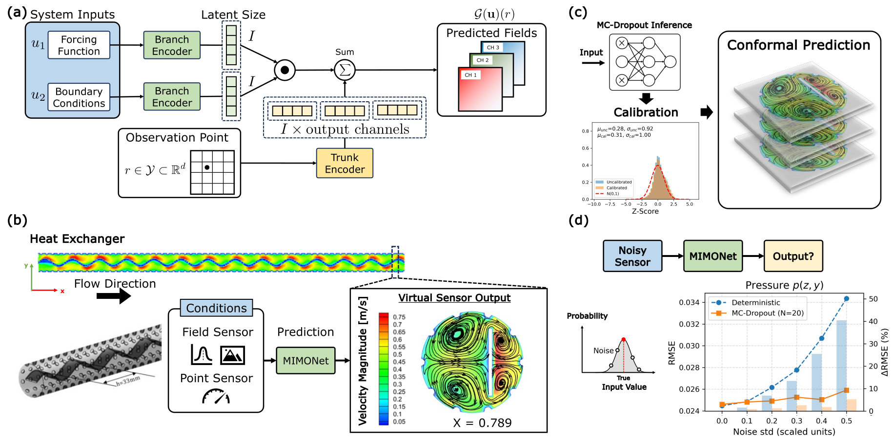

# MIMONet

**MIMONet** is a **multi-input, multi-output neural operator (MIMONet)** designed for **real-time virtual sensing, field reconstruction, and diagnostics** in complex physical systems where direct instrumentation is limited or infeasible. The framework learns operators that map heterogeneous boundary conditions, sparse sensor signals, and physical parameters to full spatiotemporal fields such as velocity, pressure, temperature, and turbulence quantities.

MIMONet combines the expressive power of neural operators with lightweight inference, enabling **millisecond-scale prediction** with high fidelity and calibrated uncertainty estimates. The framework is suitable for digital twins, nuclear thermal-fluids monitoring, and scientific simulation workflows requiring fast, reliable surrogate models.

---
## MIMONet Overview

## Key Features

- **Operator Learning for High-Dimensional Field Reconstruction**  
  Learns nonlinear mappings
  
  $$
  \mathcal{G}: \mathcal{U} \to \mathcal{S},
  $$ 
  
  where $\mathcal{U}$ contains boundary conditions, forcing terms, or sparse sensor inputs, and $\mathcal{S}$ represents high-resolution physical fields. MIMONet supports mesh-aware coordinate-based decoding.

- **Heterogeneous Input Fusion**  
  Integrates scalar inputs, function-valued signals, and geometric encodings via a **multiplicative fusion operator**, enabling efficient multimodal representation.

- **Coupled Multiphysics Output Prediction**  
  Predicts multiple correlated fields jointly (e.g., velocity–pressure–temperature), preserving **physical coherence** across output channels.

- **Uncertainty Quantification**  
  Provides **fast, calibrated UQ** using Monte Carlo dropout with conformal prediction, generating statistically meaningful confidence intervals.

- **Noise and Sparsity Robustness**  
  Resilient to sensor noise, drift, missing modalities, and degraded measurements, without requiring retraining.

- **General Applicability**  
  Validated on representative fluid and multiphysics benchmarks:
  - **LDC** – Lid-Driven Cavity (incompressible Navier–Stokes)
  - **Subchannel** – PWR subchannel thermal-hydraulics
  - **HeatExchanger** – Coupled thermo-mechanical steel solidification

---

## Source Code (`src/`)

The `src/` directory contains the complete implementation of MIMONet and supporting baselines. The codebase is modular and aligned with all experiments reported in the paper.

- **`mimonet.py` / `mimonet_drop.py`** — Core neural operator architecture and stochastic extension  
- **`training.py`** — Training loop, validation pipeline, and checkpoint management  
- **`utils.py`** — Data loading, metrics, visualization, and utility helpers  
- **`fcn.py`** — Fully connected network baseline  

All modules support GPU acceleration and mixed-precision training.

---

## Data Availability

All datasets and pretrained model parameters used in this study are publicly available at:

**[Google Drive Dataset and Pretrained Models](https://drive.google.com/drive/folders/185K0BCAamuoinwJk-Un2Q52uAFpoN9gz?usp=sharing)**

The shared directory contains full simulation datasets, model checkpoints, and evaluation outputs for all three benchmark systems (LDC, Subchannel, HeatExchanger).

### `Baselines/`
Contains all baseline experiments evaluated in the study, organized by case:

- `data/` — preprocessed datasets and configuration files, results (saved as numpy arrays)  
- `model/` — pretrained weights

### `Benchmark/`
Includes additional operator-learning baselines with pretrained checkpoints:

- **KCN** — Kernel Convolution Network  
- **NOMAD** — Neural Operator with Multi-Adam Dynamics  
- **GeoFNO** — Geometry-aware Fourier Neural Operator  

These resources provide complete reproducibility for all quantitative comparisons, ablation analyses, and field-reconstruction experiments.

---

## Citation

If you use this repository, datasets, or pretrained models, please cite:

> **Kobayashi, K., Ahmed, F., and Alam, S. B.**  
> *Virtual sensing to enable real-time monitoring of inaccessible locations and unmeasurable parameters.*  
> **arXiv:2412.00107**, 2024.

---
